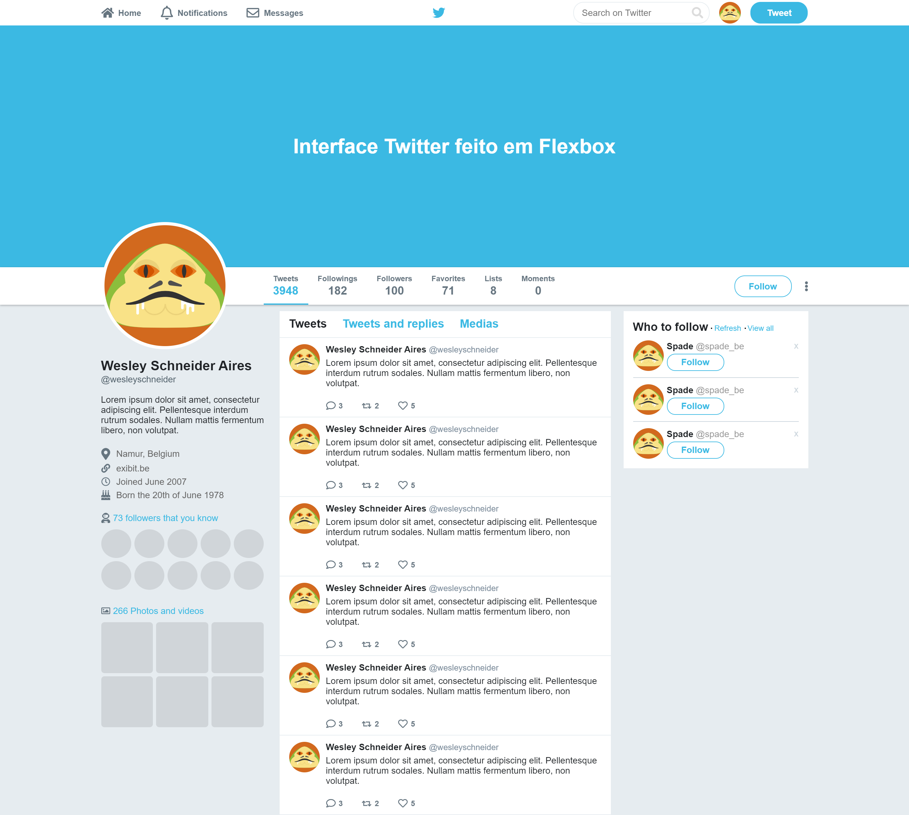

<p align="center">
  <h1 align="center">
    🐦
  </h1>
 
  <h3 align="center">
    Interface Twitter Flexbox
  </h1>
 
  <p align="center">  
    Interface do Twitter feito em Flexbox.
  </p>
</p>

<!-- TABLE OF CONTENTS -->
## Table of Contents

* [About the Project](#about-the-project)
* [Getting Started](#getting-started)
  * [Installation](#installation)
* [Contributing](#contributing)
* [License](#license)
* [Contact](#contact)


<!-- ABOUT THE PROJECT -->
## About The Project



The project is similar to Twitter's interface.
Made in `Flexbox`.<br/>
**Built on Rocketseat Bootcamp GoStack.**


<!-- GETTING STARTED -->
## Getting Started

### Installation
 
1. Clone the repo
```sh
git clone https://github.com/wesleyschneider/Interface-Twitter-Flexbox.git
```
2. Open `index.html` in browser


<!-- CONTRIBUTING -->
## Contributing

Contributions are what make the open source community such an amazing place to be learn, inspire, and create. Any contributions you make are **greatly appreciated**.

1. Fork the Project
2. Create your Feature Branch (`git checkout -b feature/AmazingFeature`)
3. Commit your Changes (`git commit -m 'Add some AmazingFeature'`)
4. Push to the Branch (`git push origin feature/AmazingFeature`)
5. Open a Pull Request


<!-- LICENSE -->
## License

Distributed under the MIT License. See `LICENSE` for more information.


<!-- CONTACT -->
## Contact

Wesley Schneider Aires - [Linkedin Profile](https://www.linkedin.com/in/wesley-schneider-aires/)

Project completed at Bootcamp GoStack - [Rocketseat](https://rocketseat.com.br/)


<!-- MARKDOWN LINKS & IMAGES -->
<!-- https://www.markdownguide.org/basic-syntax/#reference-style-links -->
